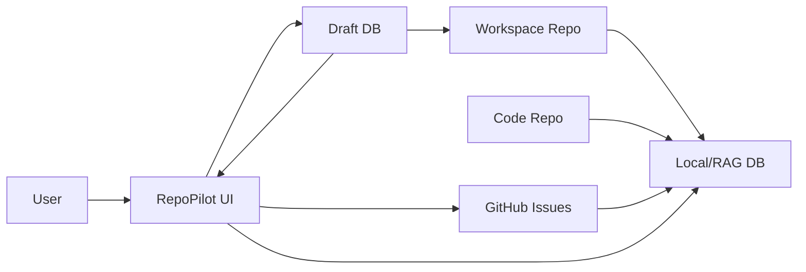
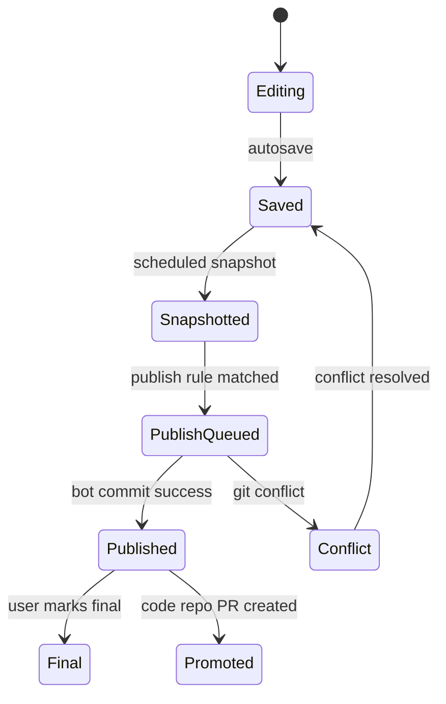

# Information Architecture

## 핵심 결정

`RepoPilot MVP`는 하나의 Git 저장소에 모든 것을 넣지 않는다. 코드 형상관리, 협업 문서, 실시간 편집, 검색/RAG, 일감 관리는 서로 다른 원본 책임을 가진다.

```text
code repo
  - 실제 코드 형상관리 원본
  - PR, test, deploy, source history
  - 앱은 기본적으로 read/index
  - 변경은 PR proposal만 허용

workspace repo
  - 회의록, 위키, API 문서, 결정사항, 개발 히스토리 원본
  - 앱 서버 bot이 자동 publish commit
  - 사용자가 직접 push하지 않는 것을 기본 정책으로 둠

Draft DB
  - 실시간 편집과 자동저장 원본
  - 사용자가 타이핑하는 모든 변경의 즉시 저장 위치
  - publish 전까지 Git commit 아님

GitHub Issues
  - 일감 원본
  - status, assignee, due, comment, milestone
  - Home, Board, Calendar의 task 데이터 원본

Local/RAG DB
  - 빠른 조회, 검색, AI context, sync state 캐시
  - 원본이 아니라 재생성 가능한 인덱스
```

이 구조의 목적은 코드 레포의 커밋 히스토리를 문서 자동저장 커밋으로 오염시키지 않고, 동시에 사용자에게는 Notion처럼 자연스러운 자동저장 경험을 제공하는 것이다.

## 전체 데이터 지도



## 원본 책임

| 데이터 | 원본 | 보조 저장 | 설명 |
|---|---|---|---|
| 코드 | code repo | RAG DB | 앱은 읽고 분석한다. 직접 push하지 않는다. |
| PR | GitHub Pull Requests | RAG DB | code repo 변경은 PR로만 제안한다. |
| 일감 | GitHub Issues | local cache | 보드/캘린더/홈은 issue를 보기 좋게 재구성한다. |
| 일정 | GitHub Issue convention 또는 Workspace Item | events cache | `Due:`와 `startAt/endAt`을 파싱한다. |
| 회의록 | Draft DB -> workspace repo | RAG DB | 자동저장 후 자동 publish한다. |
| 위키 | Draft DB -> workspace repo | RAG DB | Markdown snapshot으로 Git에 남긴다. |
| API 문서 | Draft DB -> workspace repo | RAG DB | code repo 반영 필요 시 PR proposal 생성 |
| 결정사항 | Draft DB -> workspace repo | RAG DB | ADR 형식으로 publish한다. |
| AI action log | app DB -> workspace repo batch | audit log | 실행 근거와 결과를 남긴다. |
| 실시간 커서/접속자 | realtime server memory | optional presence log | 영구 문서 원본이 아니다. |

## Workspace Item

사용자가 만드는 모든 게시물은 하나의 `Workspace Item`이다. 여러 DB 중 하나에 넣는 방식이 아니라, 같은 item이 타입과 속성에 따라 여러 화면에 나타난다.

```ts
type WorkspaceItem = {
  id: string
  workspaceId: string
  type:
    | "schedule"
    | "task"
    | "meeting"
    | "document"
    | "wiki"
    | "api_doc"
    | "decision"
    | "dev_log"
  title: string
  bodyMarkdown: string
  status: "draft" | "review" | "final" | "archived"
  ownerId: string
  assigneeIds: string[]
  startAt?: string
  endAt?: string
  dueAt?: string
  tags: string[]
  source: "draft_db" | "workspace_repo" | "github_issue" | "ai_generated"
  githubIssueId?: number
  workspacePath?: string
  relatedItemIds: string[]
  relatedFilePaths: string[]
  typeProperties: Record<string, unknown>
  archivedTypeProperties: Record<string, Record<string, unknown>>
  extraProperties: Record<string, unknown>
  createdAt: string
  updatedAt: string
  lastSnapshotAt?: string
  lastPublishedAt?: string
}
```

## 타입과 저장 경로

| type | 주요 용도 | publish path | 주요 뷰 |
|---|---|---|---|
| `schedule` | 일정, 회의, 데드라인 | optional | Home, Calendar |
| `task` | 일감 | GitHub Issue | Home, Board, Calendar |
| `meeting` | 회의록 | `docs/meetings/YYYY-MM-DD-title.md` | Home, Meetings, Calendar |
| `document` | 일반 문서 | `docs/documents/title.md` | Docs, Search |
| `wiki` | 지식 베이스 | `docs/wiki/title.md` | Wiki, Search/RAG |
| `api_doc` | API 문서 | `docs/specs/api/title.md` | API Docs, Drift Detector |
| `decision` | 의사결정/ADR | `docs/decisions/ADR-XXX-title.md` | Decisions, Home |
| `dev_log` | 개발 히스토리 | `docs/history/YYYY-MM-DD-dev-log.md` | History, AI context |

## 타입 변경 규칙

사용자는 작성 중인 item의 타입을 바꿀 수 있어야 한다.

예시:

```text
Document로 작성 시작
-> type을 Meeting으로 변경
-> participants, agenda, decisions, actionItems 속성 추가
-> publish path가 docs/meetings/...로 변경
-> Calendar와 Meetings에 동시에 표시
```

타입 변경 원칙:

1. 본문은 절대 삭제하지 않는다.
2. 새 타입의 필수 속성을 추가한다.
3. 기존 타입에만 있던 속성은 `archivedTypeProperties[oldType]`에 보존한다.
4. GitHub Issue와 연결된 item은 `task`로 변환할 때 issue 생성 후보를 만든다.
5. publish 전 타입 변경은 Draft DB에서만 처리한다.
6. publish 후 타입 변경은 새 path로 publish하고 이전 path는 redirect/frontmatter link를 남긴다.

## 타입 속성 보존 정책

타입 변경 정책의 핵심은 다음이다.

```text
Draft DB에서는 절대 속성을 삭제하지 않는다.
Publish된 Markdown에는 현재 타입에 필요한 속성만 깔끔하게 기록한다.
이전 타입 속성은 archivedTypeProperties에 보관하고, 사용자가 타입을 되돌리면 복원한다.
```

### 속성 분류

| 분류 | 예시 | 타입 변경 시 | publish 시 |
|---|---|---|---|
| Core properties | title, body, owner, status, tags, assignees, related items | 항상 유지 | 항상 또는 현재 타입 규칙에 따라 기록 |
| Shared schedule properties | startAt, endAt, dueAt | 호환되는 타입이면 유지 | 일정/마감이 의미 있으면 기록 |
| Active type properties | meeting.participants, api_doc.service | 현재 타입 속성으로 표시 | 현재 타입 frontmatter에 기록 |
| Archived type properties | 이전 meeting agenda, 이전 api_doc endpointGroup | Draft DB에 보존, 기본 숨김 | 기본적으로 기록하지 않음 |
| Extra properties | schema에 없는 외부/미확정 값 | 보존, 고급 영역에 표시 | 기본적으로 기록하지 않음 |

### 타입 변경 알고리즘

```text
1. 현재 typeProperties를 archivedTypeProperties[currentType]에 저장
2. 새 타입이 이전에 사용된 적 있으면 archivedTypeProperties[newType]에서 복원
3. 새 타입이 처음이면 기본 속성을 생성
4. core/shared 속성은 compatibility rule에 따라 유지
5. 새 타입과 맞지 않는 속성은 삭제하지 않고 archive 영역으로 이동
6. item_versions와 audit_logs에 type change 기록
```

예시:

```text
Schedule -> Meeting
  유지: title, body, startAt, endAt, attendees
  추가: agenda, decisions, actionItems
  archive: schedule.location이 meeting.location으로 매핑되지 않으면 archivedTypeProperties.schedule에 보존

Meeting -> API Doc
  유지: title, body, owner, tags, relatedIssues
  추가: service, endpointGroup, relatedSourcePaths, reviewStatus
  archive: participants, agenda, decisions, actionItems

API Doc -> Meeting
  archivedTypeProperties.meeting에 있던 participants/agenda/decisions/actionItems 복원
```

### Draft 상태 정책

Draft 상태에서는 타입을 여러 번 바꿔도 이전 타입 속성을 모두 보존한다.

```text
Document -> Meeting -> API Doc -> Meeting
```

위 흐름에서는 처음 Meeting 때 입력한 참석자, 안건, 결정사항이 다시 Meeting으로 돌아왔을 때 복원되어야 한다.

사용자에게는 다음처럼 표시한다.

```text
이전 Meeting 속성 4개가 복원되었습니다.
API Doc 속성은 보관됨에 저장되었습니다.
```

### Publish 상태 정책

workspace repo에 publish할 때는 현재 타입에 필요한 속성만 frontmatter로 내보낸다. 이전 타입 속성을 모두 frontmatter에 넣으면 문서가 지저분해지고, 검색/RAG metadata도 흐려진다.

publish frontmatter에는 다음만 포함한다.

- core properties
- 현재 타입의 active type properties
- 현재 타입에 의미 있는 shared schedule properties
- relation metadata
- type history summary

예시:

```yaml
id: item_01HXYZ
type: meeting
title: API 회의
startAt: 2026-06-20T10:00:00+09:00
endAt: 2026-06-20T11:00:00+09:00
participants: [frontend, backend]
relatedIssues: [42]
typeHistory:
  - document
  - meeting
lastPublishedAt: 2026-06-20T11:05:00+09:00
```

이전 타입의 세부 속성은 publish된 Markdown frontmatter에 기본 포함하지 않는다. 대신 다음 위치에 남는다.

- Draft DB `archivedTypeProperties`
- `item_versions`
- `audit_logs`
- 필요 시 `.workspace/action-log/` batch log

### 이미 publish된 item의 타입 변경

이미 workspace repo에 publish된 item의 타입을 바꾸면 path가 바뀔 수 있다.

예시:

```text
docs/documents/api-meeting.md
-> type 변경: meeting
-> docs/meetings/2026-06-20-api-meeting.md
```

정책:

1. 새 타입 path에 새 Markdown을 publish한다.
2. 이전 path의 파일은 자동 삭제하지 않는다.
3. 이전 파일에는 `supersededBy` 또는 redirect frontmatter를 남긴다.
4. 사용자가 명시적으로 정리할 때만 이전 파일을 archive/delete한다.

redirect 예시:

```md
---
id: item_01HXYZ
type: redirected
supersededBy: docs/meetings/2026-06-20-api-meeting.md
typeChangedAt: 2026-06-20T11:05:00+09:00
---

This document moved to docs/meetings/2026-06-20-api-meeting.md.
```

### 삭제 정책

기본값은 삭제하지 않는 것이다.

- Draft DB의 archived type properties는 프로젝트 기간 동안 보존한다.
- publish된 Markdown에는 현재 타입 속성만 기록한다.
- 오래된 archived properties 정리는 P1에서 admin cleanup 기능으로 처리한다.
- 자동 publish worker는 type mismatch 속성을 절대 자동 삭제하지 않는다.

## Frontmatter

workspace repo에 publish된 Markdown은 frontmatter를 가진다. frontmatter는 Notion database 속성처럼 동작한다.

```md
---
id: item_01HXYZ
type: api_doc
status: review
title: Auth API
owner: woonyong
assignees: [backend]
startAt: 2026-06-20T09:00:00+09:00
dueAt: 2026-06-24T18:00:00+09:00
githubIssues: [12, 13]
relatedFiles:
  - repo:code
    path: src/routes/auth.ts
tags: [auth, api]
lastPublishedAt: 2026-06-20T11:03:00+09:00
---

# Auth API
```

frontmatter가 제공하는 효과:

- Home card 표시
- Calendar event 표시
- Board/Task 연결
- 담당자/상태/태그 필터
- GitHub Issue 연결
- RAG metadata
- AI action 근거

## Workspace Repo 폴더 구조

```text
docs/
├── README.md
├── project/
│   ├── goals.md
│   ├── roadmap.md
│   └── milestones.md
├── documents/
│   └── onboarding.md
├── specs/
│   ├── architecture.md
│   ├── data-model.md
│   └── api/
│       └── auth-api.md
├── meetings/
│   └── 2026-06-20-kickoff.md
├── decisions/
│   └── ADR-001-use-workspace-repo.md
├── wiki/
│   └── glossary.md
├── history/
│   └── 2026-06-20-dev-log.md
├── retrospectives/
│   └── week-1.md
└── action-log/
    └── 2026-06-20.md

.workspace/
├── config.yml
├── views.yml
├── fields.yml
├── publish.yml
├── agents.yml
├── issue-conventions.md
└── linked-repos.yml
```

## Draft Lifecycle



상태 의미:

| 상태 | 의미 |
|---|---|
| `Editing` | 사용자가 편집 중 |
| `Saved` | Draft DB에 자동저장됨 |
| `Snapshotted` | 복구 가능한 DB 버전 생성 |
| `PublishQueued` | Git publish job 대기 |
| `Published` | workspace repo에 commit 완료 |
| `Final` | 사람이 최종 확정 표시 |
| `Promoted` | code repo PR로 승격 |
| `Conflict` | 외부 변경 또는 publish 충돌 발생 |

## 자동 Publish 규칙

유저는 publish 버튼을 누르지 않는다. 시스템이 문서 타입과 편집 상태를 보고 자동 publish한다.

| 타입 | 자동 publish 조건 |
|---|---|
| meeting | 회의 종료 시간 이후 + 마지막 편집 5분 경과 + active editor 없음 |
| wiki | 마지막 편집 10분 경과 |
| api_doc | 마지막 편집 10분 경과 또는 AI patch 승인 |
| decision | status가 `review` 또는 `final`로 변경됨 |
| dev_log | 하루 1회 또는 30분 batch |
| action_log | 10분 batch commit |

공통 guard:

- 빈 문서 publish 금지
- 이전 publish와 내용이 같으면 commit 금지
- 한 item당 최소 publish 간격 5분
- 최대 미게시 시간 30분
- workspace repo write lock 획득 후 commit
- 충돌 시 자동 overwrite 금지

## 일정 모델

일정은 독립 item일 수도 있고, 다른 item의 속성일 수도 있다.

```text
회의 일정
  type = meeting
  startAt/endAt 있음
  Calendar + Meetings에 표시

일감 마감
  type = task
  dueAt 있음
  Calendar + Board + My Work에 표시

문서 리뷰 일정
  type = api_doc
  dueAt 있음
  Calendar + Docs에 표시
```

GitHub Issue의 일정 convention:

```md
## Plan

Due: 2026-06-24
Estimate: 4h
Sprint: week-1
```

## 뷰 규칙

| 조건 | 나타나는 위치 |
|---|---|
| `startAt` 또는 `dueAt` 있음 | Calendar |
| `type = meeting` | Meetings |
| `githubIssueId` 있음 | Tasks |
| `status = blocked` | Home Blocked |
| `type = decision` | Decisions |
| `type = api_doc` | API Docs |
| `assigneeIds`에 현재 사용자 | My Work |
| `lastPublishedAt` 없음 | Drafts |
| AI proposal 있음 | Approvals |

## 로컬 DB 주요 테이블

| 테이블 | 설명 |
|---|---|
| `users` | 앱 사용자 |
| `workspaces` | 팀 워크스페이스 |
| `memberships` | 앱 내부 role |
| `repositories` | code/workspace/linked repo |
| `workspace_items` | 모든 게시물의 공통 모델 |
| `item_versions` | Draft DB 스냅샷 |
| `realtime_documents` | Yjs/CRDT 문서 상태 |
| `publish_jobs` | workspace repo 자동 publish 작업 |
| `publish_locks` | repo write 직렬화 lock |
| `repo_files` | 파일 경로, hash, 언어, 크기 |
| `documents` | publish된 Markdown 문서 메타데이터 |
| `github_issues` | GitHub Issue 동기화 캐시 |
| `github_pull_requests` | PR 동기화 캐시 |
| `events` | 일정/회의/마감 index |
| `chunks` | RAG chunk |
| `search_index` | SQLite FTS index |
| `embeddings` | optional vector |
| `entity_links` | 문서-파일-이슈-커밋 관계 |
| `agent_actions` | AI 액션 로그 |
| `audit_logs` | 사용자/서버/AI 변경 로그 |
| `sync_jobs` | Git/GitHub/RAG sync 상태 |

## 문서와 GitHub Issue 연결

문서 본문:

```md
관련 이슈: #42, #43
```

frontmatter:

```yaml
githubIssues: [42, 43]
```

AI 인덱스에서는 다음 관계로 저장한다.

```text
workspace_item -> github_issue
workspace_item -> repo_file
github_issue -> pull_request
pull_request -> commit
commit -> repo_file
```

이 관계가 있어야 "이 문서가 실제 구현과 맞는가?", "완료 가능한 일감이 무엇인가?", "회의록 action item이 issue로 반영됐는가?"라는 질문에 답할 수 있다.
