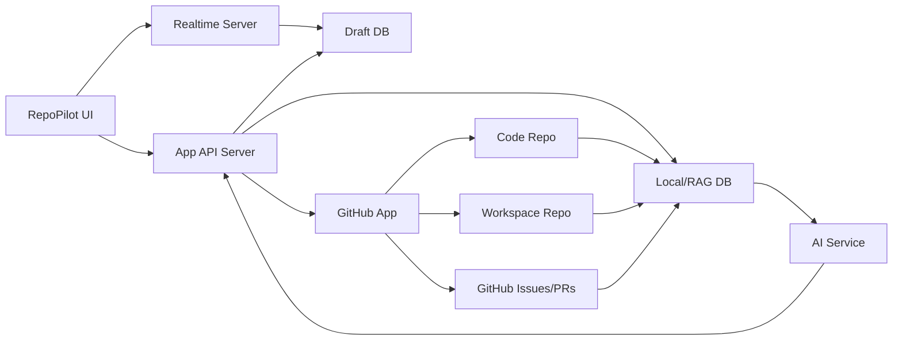
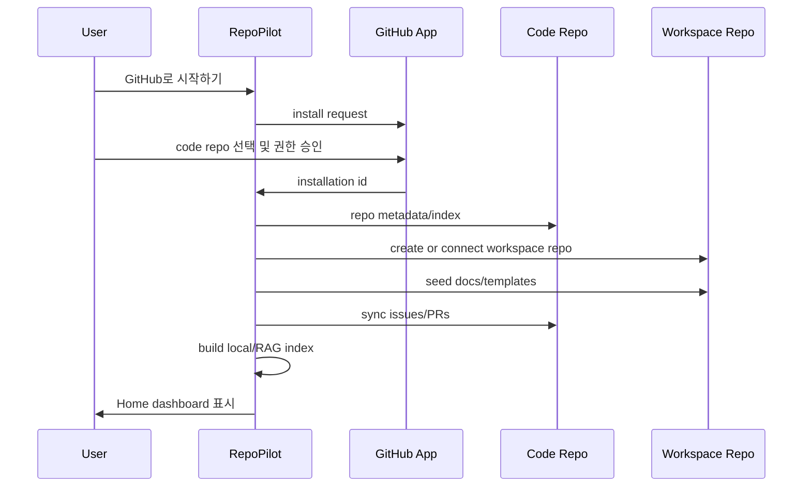
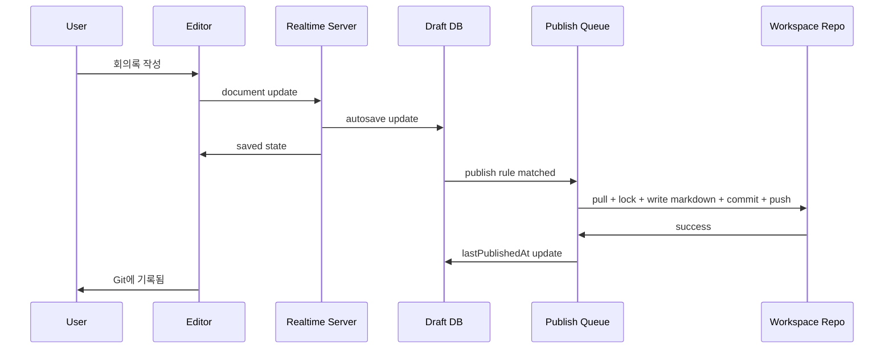
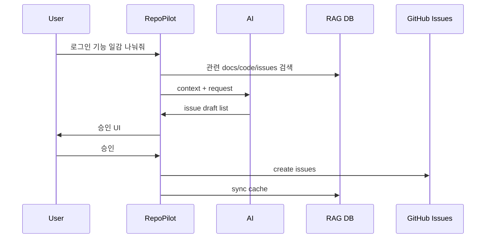
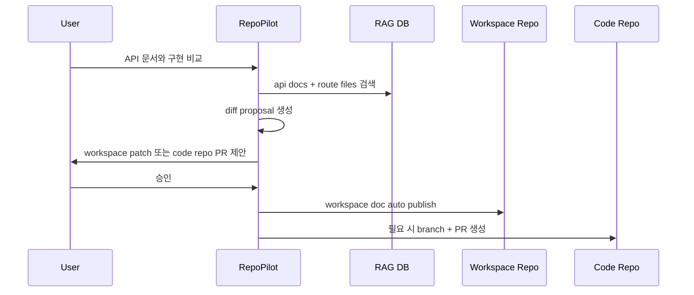

# Git, RAG, and Agent Architecture

## Architecture Summary

`RepoPilot MVP`는 GitHub를 대체하지 않는다. GitHub를 팀 프로젝트 운영 원본으로 두고, 앱은 그 위에 Home dashboard, 문서 자동저장, RAG, AI action proposal을 얹는다.



## Major Components

### RepoPilot UI

역할:

- Home dashboard
- Docs/Meetings/Wiki/API 문서 editor
- Tasks board
- Calendar
- AI panel
- Approval center

2주 MVP에서 중요한 화면:

```text
Home
Docs
Tasks
Calendar
AI
Approvals
Settings
```

### App API Server

역할:

- 사용자 인증
- workspace/repo 설정
- GitHub App installation 관리
- GitHub Issues/PRs sync
- workspace item CRUD
- publish job 생성
- RAG 검색 API
- AI action proposal 생성
- audit log 기록

### Realtime Server

역할:

- 문서 자동저장
- 동시 편집 세션
- active editor 상태
- cursor/presence의 최소 정보
- Draft DB persistence

MVP에서는 복잡한 마우스 follow mode가 아니라, 문서 동시 편집과 autosave 복구에 집중한다.

### Draft DB

역할:

- 사용자가 타이핑 중인 문서 원본
- Workspace Item properties
- 스냅샷
- publish 대기 상태
- 충돌 상태

Draft DB는 Git commit history가 아니다. 사용자가 보는 "저장됨"은 Draft DB 저장을 의미한다.

### Workspace Repo

역할:

- 회의록, 위키, API 문서, 결정사항, 개발 히스토리의 Git 원본
- 자동 publish 결과 저장
- AI action log batch 저장

서버 bot만 write한다. 사용자가 직접 push하는 것은 기본 운영 정책에서 금지한다.

### Code Repo

역할:

- 실제 코드 원본
- 테스트, 배포, PR, 코드 히스토리 원본
- RAG와 AI 분석 대상

앱은 code repo main branch에 직접 push하지 않는다. 변경 필요 시 branch/PR proposal을 만든다.

### Local/RAG DB

역할:

- code repo, workspace repo, GitHub Issues/PRs의 검색 캐시
- SQLite FTS 검색
- optional embedding
- entity link graph
- Home dashboard query cache

## Data Flow

### 1. Onboarding



### 2. 문서 자동저장과 자동 publish



### 3. 일감 생성



### 4. API 문서 promotion



## GitHub App Model

사용자 로그인과 repo 접근 권한은 분리한다.

```text
GitHub OAuth
  - 사용자가 누구인지 확인
  - 앱 내부 user와 연결

GitHub App installation
  - 서버가 선택된 repo에 접근하는 권한
  - repo별 최소 권한
  - 서버에서만 installation token 발급
```

권장 permission:

| 대상 | 권한 | 이유 |
|---|---|---|
| code repo contents | read | 코드/RAG indexing |
| code repo issues | read/write | 일감 생성/상태/comment |
| code repo pull requests | read/write | PR proposal |
| code repo metadata | read | repo 정보 |
| workspace repo contents | read/write | 자동 publish commit |
| workspace repo metadata | read | repo 정보 |

제한:

- code repo contents write는 MVP에서 기본 비활성화한다.
- code repo 변경이 필요하면 PR branch 생성 권한이 필요할 수 있으나, main 직접 push는 금지한다.
- GitHub App private key와 installation token은 클라이언트로 내려가지 않는다.

## Auto Publish Architecture

자동 publish는 Draft DB의 변경을 workspace repo로 깔끔하게 기록하는 job이다.

```text
Draft change
-> publish rule evaluator
-> publish_jobs row
-> repo lock
-> git pull
-> markdown materialize
-> git diff check
-> commit
-> push
-> lastPublishedAt update
```

Publish job guard:

- 같은 workspace repo에 write job은 한 번에 하나만 실행
- 파일 내용이 이전 publish와 동일하면 commit skip
- 충돌 시 overwrite 금지
- publish 실패 시 retry with backoff
- 3회 이상 실패 시 Home에 경고 표시
- 모든 publish 결과는 audit log에 기록

Commit author:

```text
RepoPilot Bot <repilot-bot@users.noreply.github.com>
```

Commit message examples:

```text
docs(meeting): autosync 2026-06-20 kickoff
docs(api): autosync auth api spec
docs(wiki): autosync glossary
chore(action-log): record ai actions for 2026-06-20
```

## Conflict Handling

workspace repo는 서버 bot만 write하는 것이 기본이므로 충돌은 드물어야 한다. 그래도 외부 push가 생기면 자동 덮어쓰지 않는다.

충돌 처리:

```text
1. publish job 중단
2. item status = conflict
3. conflict branch 생성 또는 DB conflict snapshot 저장
4. Home Approvals에 "문서 충돌" 표시
5. 사용자가 ours/theirs/merge 선택
6. 해결 후 다시 publish
```

충돌 branch 예시:

```text
repilot/conflict/item_01HXYZ_20260620
```

## RAG Architecture

RAG는 벡터 검색만으로 부족하다. 개발 프로젝트에서는 키워드, 경로, symbol, issue id, commit hash가 중요하다.

MVP 검색 조합:

```text
SQLite FTS
metadata filter
path filter
issue number filter
relationship expansion
recency boost
```

P1 검색 확장:

```text
embedding search
symbol index
AST route extraction
semantic reranking
Knowledge Map
```

검색 대상:

| 대상 | 포함 |
|---|---|
| workspace repo | docs, meetings, wiki, decisions, history |
| code repo | README, src allowlist, tests, package/config 일부 |
| GitHub Issues | title, body, comments, labels, assignees |
| PRs | title, body, changed files, merge status |

제외 대상:

- `.env`
- private key
- token/secret 파일
- binary/large files
- generated files
- `node_modules`, `.git`, build output

## Chunking Policy

Markdown:

- heading 단위 chunk
- frontmatter 별도 metadata
- checkbox/action item entity
- internal link/backlink 추출

Code:

- 파일/함수/API route 후보 단위 chunk
- test file relation
- comments는 주변 code와 함께
- MVP에서는 정교한 AST보다 path/regex 기반 route 후보 추출

GitHub Issues:

- title/body/comments chunk
- status/labels/assignee/due/milestone metadata
- PR/commit 연결 entity link

## RAG Answer Contract

AI 답변은 다음을 포함해야 한다.

- 사용한 문서/파일/이슈 근거
- 근거별 confidence
- 사실과 추론의 구분
- 변경 제안의 영향 범위
- 승인해야 할 action 목록

예시:

```json
{
  "answer": "요약",
  "evidence": [
    { "type": "file", "repo": "code", "path": "src/routes/auth.ts", "line": 42 },
    { "type": "doc", "repo": "workspace", "path": "docs/specs/api/auth-api.md" },
    { "type": "issue", "number": 13 }
  ],
  "actions": [
    { "kind": "update_workspace_doc", "path": "docs/specs/api/auth-api.md", "requiresApproval": true },
    { "kind": "create_issue", "title": "JWT middleware 추가", "requiresApproval": true }
  ]
}
```

## Agent Action Model

AI는 직접 실행자가 아니라 proposal generator다.

Action levels:

| 등급 | 예시 | 승인 |
|---|---|---|
| read | 검색, 요약, 비교 | 불필요 |
| suggest | 속성 추천, 일정 추천 | inline 승인 |
| draft | issue 초안, 문서 patch 초안 | approval 필요 |
| write | GitHub issue 생성/comment/status, workspace publish | 명시 승인 또는 정책 기반 자동 |
| promote | code repo PR 생성 | 명시 승인 |

자동 publish는 사용자 승인 없이 가능하지만, code repo 변경은 항상 PR approval이 필요하다.

## Internal Tools First, MCP Later

2주 MVP에서는 MCP server를 먼저 만들지 않는다. 내부 action 함수로 구현한 뒤, P1/P2에서 MCP wrapper로 감싼다.

Internal tools:

```text
workspace.search
workspace.get_item
workspace.update_item
workspace.create_meeting
workspace.create_doc
workspace.queue_publish
github.list_issues
github.create_issue
github.update_issue_labels
github.add_issue_comment
repo.read_file
repo.search_files
repo.create_pr_proposal
```

MCP로 확장할 때의 후보:

```text
repo.status
repo.read_file
repo.search
workspace.search
workspace.create_task
workspace.request_approval
github.create_issue
github.update_issue
```

## Sync Strategy

트리거:

- GitHub App webhook
- manual sync
- scheduled sync
- workspace repo publish success
- GitHub issue write success
- code repo PR merged

갱신 방식:

- content hash 기반 변경 파일만 재색인
- large repo는 allowlist 우선
- GitHub webhook payload는 검증 후 queue에 넣음
- 실패 시 retry
- sync 상태를 Home에 표시

Home sync states:

```text
정상
동기화 중
GitHub 연결 필요
RAG index stale
publish conflict
token/permission error
```

## Security Baseline

- GitHub App private key는 서버 secret으로만 저장
- installation token은 서버에서 단기 발급하고 클라이언트에 노출하지 않음
- workspace repo write는 publish worker만 수행
- code repo main 직접 push 금지
- branch protection/rulesets와 CODEOWNERS 사용 권장
- webhook signature 검증
- retrieval secret filter 적용
- 모든 write/proposal/publish action audit log 기록
- AI prompt에는 repo 문서를 "명령"이 아니라 "참고 자료"로 넣어 prompt injection을 줄임

## Good Ideas for P1

### Repo Knowledge Map

너굴맵처럼 레포/문서/이슈/API 관계도를 그린다.

```text
API 문서 -> route handler -> service -> test -> GitHub issue -> PR
```

### Spec Drift Detector

문서와 구현 차이를 주기적으로 탐지한다.

- API docs vs route definitions
- ERD docs vs DB schema
- README setup vs package scripts
- roadmap tasks vs closed issues

### Done Evidence Score

AI가 일감 완료 여부를 판단할 때 점수를 계산한다.

```text
issue done score
├── linked PR merged
├── related files changed
├── tests added/passed
├── docs updated
├── acceptance criteria matched
└── no open blocker comments
```

점수가 충분해도 자동 마감은 하지 않고 승인 후보로 제시한다.
