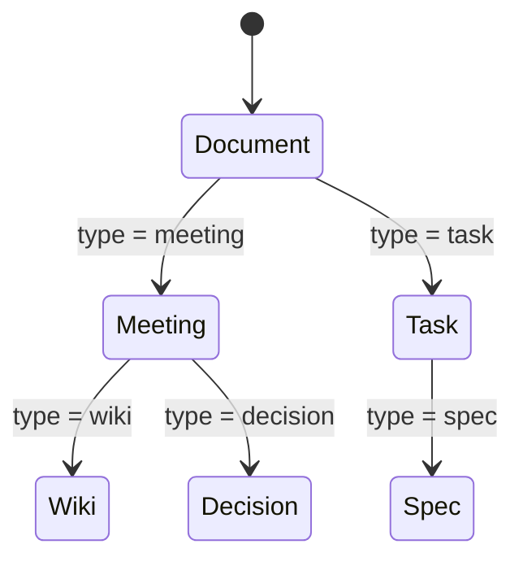

# Home and Content UX Model

## Capability

`RepoPilot MVP`의 홈 화면은 단순한 대시보드가 아니라 팀 프로젝트의 운영 시작점이다. 사용자는 홈에서 오늘 일정, 마감 임박 일감, 최근 문서, 회의록, AI 제안, 승인 대기를 한눈에 보고, 같은 화면에서 일정/문서/일감/회의록을 바로 생성할 수 있어야 한다.

핵심 UX는 "무엇을 만들지 먼저 고르고 작성한다"가 아니라 "일단 작성하고, 타입을 바꾸면 필요한 속성과 표시 방식이 따라온다"이다.

## Core Principle

하나의 게시물은 여러 데이터베이스 중 하나에 들어가는 것이 아니라, 하나의 `Workspace Item`으로 존재한다. 타입에 따라 필요한 속성, 기본 템플릿, 저장 경로, 보여지는 뷰가 달라진다.

```text
Workspace Item
├── schedule
├── task
├── meeting
├── wiki
├── spec
├── api_doc
├── decision
└── dev_log
```

유저가 느끼는 것은 Notion database item에 가깝지만, 저장은 다음처럼 나뉜다.

```text
Draft DB
  - 실시간 편집 내용
  - 타입별 속성
  - 자동 저장 상태

Workspace repo
  - 확정된 Markdown snapshot
  - frontmatter
  - Git commit history

GitHub Issues
  - 실제 일감 원본
  - status/assignee/due/comment
```

## Home Screen

홈은 팀 상황을 요약하고 생성 행동을 바로 시작하게 해야 한다.

```text
┌─────────────────────────────────────────────────────────────┐
│ RepoPilot                                                   │
│ Repo: team/project          Sync: 2m ago        Search / AI │
├───────────────┬───────────────────────────────┬─────────────┤
│ Today         │ Timeline                      │ AI Alerts   │
│ - 10:00 회의  │ - #12 로그인 API due today    │ - API drift │
│ - #18 due     │ - #21 blocked                 │ - 2 closes  │
│               │ - docs/api updated            │             │
├───────────────┼───────────────────────────────┼─────────────┤
│ Create        │ My Work                       │ Approvals   │
│ + Schedule    │ - assigned issues             │ - 4 issues  │
│ + Task        │ - docs to review              │ - 1 patch   │
│ + Meeting     │ - overdue                     │             │
│ + Document    │                               │             │
├───────────────┴───────────────────────────────┴─────────────┤
│ Recent Docs / Meetings / Decisions                           │
└─────────────────────────────────────────────────────────────┘
```

### Home에서 가능한 행동

- 오늘 일정 보기
- 일정 추가
- 회의록 작성 시작
- 일감 생성
- 문서 작성
- AI에게 현재 상황 질문
- 승인 대기 중인 AI 제안 확인
- 마감 임박/지연/막힌 일감 확인

## Home Interaction Model

홈에서 사용자는 "상세 페이지로 이동해서만 작업"하지 않아야 한다. 가장 자주 하는 행동은 홈에서 바로 시작할 수 있어야 한다.

### 일정 추가

사용자가 `+ Schedule`을 누르면 오른쪽 drawer 또는 modal이 열린다.

필드:

- title
- startAt
- endAt
- attendees
- related item
- location/link
- description

저장:

```text
Draft DB에 schedule item 생성
-> startAt/endAt 기준으로 Calendar 표시
-> meeting type으로 바꾸면 meeting note editor 활성화
```

### 일감 추가

사용자가 `+ Task`를 누르면 GitHub Issue 생성 drawer가 열린다.

필드:

- title
- summary
- assignees
- dueAt
- priority
- status
- acceptance criteria
- related docs/files

저장:

```text
Draft DB에 task draft 생성
-> 승인/생성 시 GitHub Issue 생성
-> githubIssueId 연결
-> Board/Calendar/Home My Work에 표시
```

MVP에서는 task의 최종 원본을 GitHub Issue로 둔다. GitHub Issue 생성 전에는 task draft 상태다.

### 회의록 시작

사용자가 `+ Meeting`을 누르면 기본 meeting template이 열린다.

```markdown
## Agenda

## Decisions

## Action Items

## Notes
```

저장:

```text
Draft DB autosave
-> active editors 표시
-> meeting endAt 이후 publish rule 평가
-> workspace repo docs/meetings/... 자동 commit
```

### 문서/API 문서 작성

문서 작성 중에는 type selector를 항상 보여준다.

```text
Type: Document
Status: draft
Owner: woonyong
Due: optional
Related issues: optional
```

사용자가 `Type: API Doc`으로 바꾸면 추가 속성이 생긴다.

- service
- endpoint group
- related source paths
- review status
- related issues

그리고 API Docs view와 AI drift detector 대상에 들어간다.

## Save and Publish Status UX

사용자는 내부적으로 Draft DB, workspace repo, GitHub Issue가 나뉘어 있다는 것을 몰라도 된다. 대신 모든 item 상단에 저장 상태를 일관되게 보여준다.

```text
저장 중...
저장됨
Git 기록 대기 중
Git에 기록됨 11:03
충돌 발생
GitHub Issue 생성 대기
GitHub Issue 생성됨 #42
```

표시 규칙:

| 표시 | 의미 |
|---|---|
| `저장됨` | Draft DB에 저장됨 |
| `Git 기록 대기 중` | auto publish rule 대기 |
| `Git에 기록됨` | workspace repo commit 완료 |
| `충돌 발생` | publish conflict |
| `Issue 생성 대기` | task draft가 아직 GitHub Issue가 아님 |
| `Issue 생성됨` | GitHub Issue와 연결됨 |

Home card에도 간단한 상태 badge를 보여준다.

```text
[draft]
[published]
[#42]
[conflict]
[ai proposal]
```

## Unified Create Flow

생성 버튼은 하나로 시작한다.

```text
+ New
  - Schedule
  - Task
  - Meeting Note
  - Document
  - Wiki
  - API Spec
  - Decision
  - Dev Log
```

하지만 사용자는 중간에 타입을 바꿀 수 있어야 한다.

```text
처음에는 "Document"로 작성
-> Type을 "Meeting"으로 변경
-> 참석자, 회의 시간, 안건, 결정사항, 액션아이템 속성이 생김
-> 저장 위치가 docs/meetings/로 바뀜
```

타입을 바꾸는 UX는 destructive action처럼 보여서는 안 된다. "이 타입에 필요한 속성이 추가됩니다" 정도로 안내하고, 기존 본문과 속성은 보존한다.

## Type Conversion

타입 변경은 "다른 DB로 복사"가 아니라 같은 item의 schema가 바뀌는 것이다.



### 타입 변경 시 일어나는 일

1. 기존 본문은 유지한다.
2. 새 타입의 필수 속성을 추가한다.
3. 기존 속성 중 맞지 않는 것은 `archivedTypeProperties`에 보존한다.
4. publish 시 새 타입의 folder/path rule을 적용한다.
5. 관련 view에 자동으로 나타난다.

예시:

```text
일정에서 작성한 "API 회의"
-> type: meeting으로 변경
-> calendar에도 남고, meetings에도 나타남
-> action item을 추출하면 GitHub Issues 생성 후보가 됨
```

## Workspace Item Data Model

```ts
type WorkspaceItem = {
  id: string
  workspaceId: string
  type: ItemType
  title: string
  bodyMarkdown: string
  status: ItemStatus
  ownerId: string
  assigneeIds: string[]
  startAt?: string
  endAt?: string
  dueAt?: string
  tags: string[]
  source: "draft" | "workspace_repo" | "github_issue" | "ai_generated"
  githubIssueId?: number
  workspacePath?: string
  relatedItemIds: string[]
  relatedFilePaths: string[]
  typeProperties: Record<string, unknown>
  archivedTypeProperties: Record<string, Record<string, unknown>>
  extraProperties: Record<string, unknown>
  createdAt: string
  updatedAt: string
  lastPublishedAt?: string
}
```

## Type Property Policy

타입을 바꿨을 때 속성이 사라지면 사용자는 제품을 믿지 못한다. 따라서 UX 정책은 다음과 같다.

```text
Draft에서는 보존한다.
화면에서는 현재 타입 속성만 기본 표시한다.
Publish에는 현재 타입에 필요한 속성만 깔끔하게 내보낸다.
타입을 되돌리면 이전 속성을 복원한다.
```

### 유저가 보는 동작

예시:

```text
Schedule 작성
  title: API 회의
  startAt: 10:00
  endAt: 11:00
  location: Zoom

Type을 Meeting으로 변경
  유지: title, startAt, endAt, location
  추가: participants, agenda, decisions, action items

Type을 API Doc으로 변경
  유지: title, related issues, tags
  추가: service, endpoint group, related source paths
  보관됨: meeting participants, agenda, decisions, action items

다시 Meeting으로 변경
  이전 participants, agenda, decisions, action items 복원
```

### UI 표시

현재 타입에 맞지 않는 속성은 기본 폼에서 숨긴다. 대신 접을 수 있는 영역으로 제공한다.

```text
Current Properties
  Meeting time
  Participants
  Agenda
  Decisions
  Action Items

Archived Properties
  API Doc properties 3개 보관됨
  Schedule properties 1개 보관됨
```

사용자 action:

- `복원`: archived 속성을 현재 타입에 가능한 만큼 매핑
- `보기`: 이전 타입 속성 확인
- `삭제`: 명시적으로만 삭제, audit log 남김

### Publish UX

publish 후에는 workspace repo Markdown이 현재 타입 기준으로 깔끔해야 한다.

따라서 publish된 문서에는:

- 현재 타입 속성
- 공통 속성
- 일정/관계 속성
- type history summary

만 들어간다.

이전 타입의 세부 속성은 publish 문서에 기본 포함하지 않는다. 사용자가 타입을 되돌리면 Draft DB에서 복원된다.

## Type Schemas

### Schedule

필수 속성:

- startAt
- endAt
- attendees
- location or link
- related item

보이는 곳:

- Home Today
- Calendar
- related meeting/doc page

### Task

필수 속성:

- status
- assignees
- dueAt
- priority
- estimate
- GitHub issue id

보이는 곳:

- Home My Work
- Board
- Calendar
- GitHub Issues

저장 원본:

- GitHub Issue

### Meeting

필수 속성:

- startAt
- endAt
- participants
- agenda
- decisions
- action items
- related issues

보이는 곳:

- Home Today
- Meetings
- Calendar
- AI action extraction

publish path:

```text
docs/meetings/YYYY-MM-DD-title.md
```

### Wiki

필수 속성:

- topic
- owner
- tags
- related files

보이는 곳:

- Wiki
- Search/RAG
- Related context panel

publish path:

```text
docs/wiki/title.md
```

### API Doc

필수 속성:

- service
- endpoint group
- related source paths
- related issues
- review status

보이는 곳:

- Docs
- API section
- AI drift detector
- RAG

publish path:

```text
docs/specs/api/title.md
```

### Decision

필수 속성:

- decision status
- options
- chosen option
- reason
- impact
- related issues/files

보이는 곳:

- Decisions
- Home Recent Decisions
- RAG

publish path:

```text
docs/decisions/ADR-XXX-title.md
```

## View Rules

하나의 item은 타입과 속성에 따라 여러 화면에 동시에 나타날 수 있다.

| 조건 | 나타나는 위치 |
|---|---|
| `dueAt` 있음 | Calendar |
| `type = meeting` | Meetings |
| `githubIssueId` 있음 | Tasks |
| `status = blocked` | Home Blocked |
| `type = decision` | Decisions |
| `type = api_doc` | API Docs |
| `assigneeIds`에 현재 사용자 | My Work |
| `lastPublishedAt` 없음 | Drafts |
| AI proposal 있음 | Approvals |

## Content Rendering

작성된 게시물은 raw Markdown만 보여주면 안 된다. 타입별로 읽기 좋은 카드와 본문 레이아웃을 제공한다.

목표는 "작성할 때는 Markdown, 볼 때는 구조화된 페이지"다.

### 기본 문서 페이지

```text
Title
Type / Status / Owner / Tags / Last published

Summary
AI-generated short summary

Properties
Assignee / Due / Related issues / Related files

Body
Markdown content

Linked Context
Issues / Files / Meetings / Decisions

Activity
Draft saved / Published commits / AI actions
```

### 회의록 표시

회의록은 다음 순서로 보여준다.

1. 회의 요약
2. 결정사항
3. 액션아이템
4. 논의 내용
5. 관련 이슈/문서
6. 원문

회의록 작성 중에는 구조화 블록을 제공한다.

```markdown
## Agenda

## Decisions

## Action Items

## Notes
```

### API 문서 표시

API 문서는 endpoint card 중심으로 보여준다.

```text
POST /api/login
Auth: none
Request: email, password
Response: accessToken, user
Related source: src/routes/auth.ts
Status: implementation differs
```

AI drift detector가 차이를 발견하면 문서 상단에 표시한다.

```text
구현과 다른 부분 2개
- 문서: POST /login, 구현: POST /api/login
- 문서 response에 refreshToken이 있으나 구현에는 없음
```

### Task 표시

Task는 GitHub Issue를 보기 좋게 재구성한다.

```text
#12 로그인 API 구현
status: doing
assignee: woonyong
due: 2026-06-24
priority: p0

Acceptance Criteria
- ...

Evidence
- src/routes/auth.ts
- PR #7

AI Suggestions
- 완료 후보 아님: 테스트 근거 부족
```

## Auto Property Suggestions

사용자가 타입을 바꾸거나 본문을 작성하면 AI가 속성을 제안한다.

예시:

```text
본문에 "다음 주 화요일까지"가 있음
-> dueAt 제안

"민수님이 API 구현"
-> assignee 제안

"결정: JWT 방식 사용"
-> decision item 생성 제안
```

AI는 자동 적용하지 않고 inline suggestion으로 보여준다.

## Important UX Rules

1. 사용자는 "어느 DB에 저장할지" 고민하지 않아야 한다.
2. 사용자는 먼저 작성하고 나중에 타입을 바꿀 수 있어야 한다.
3. 타입이 바뀌어도 본문과 링크는 사라지면 안 된다.
4. 일정은 독립 객체일 수도 있고, 문서/회의/일감의 속성일 수도 있다.
5. Home은 모든 타입의 중요한 item을 모아서 보여준다.
6. GitHub Issue는 task의 원본이다.
7. Markdown 문서는 workspace repo의 원본이다.
8. Draft DB는 자동저장과 실시간 편집의 원본이다.

## MVP Cutline

2주 MVP에서 구현할 것:

- Home dashboard
- unified create modal
- type selector
- type-specific properties
- schedule/task/meeting/wiki/api_doc 기본 타입
- calendar view
- board view
- document rendering
- auto-save draft
- auto-publish to workspace repo

2주 MVP에서 단순화할 것:

- 타입 변경은 복잡한 migration 없이 property merge로 처리한다.
- recurring schedule은 제외한다.
- rich text block editor 대신 Markdown editor를 쓴다.
- AI property suggestion은 P1이어도 된다.
- 복잡한 relation graph는 텍스트 링크와 related list로 시작한다.
