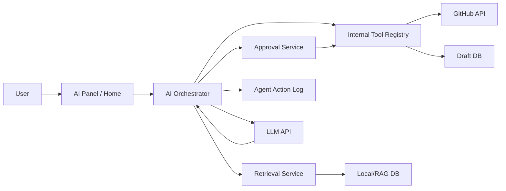
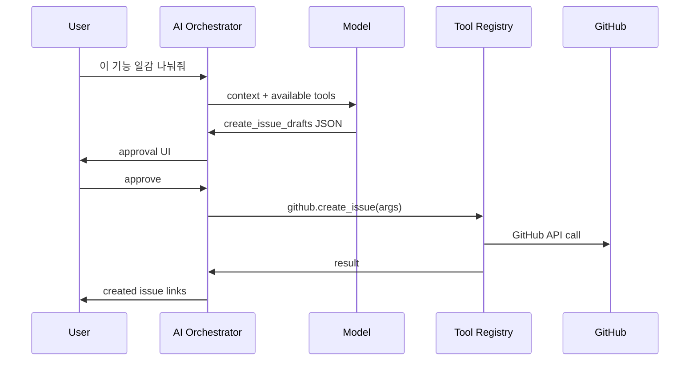
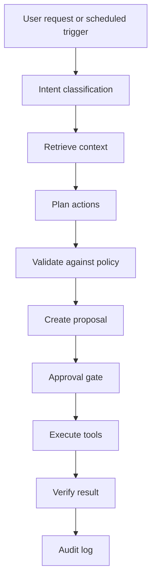

# AI Agent, RAG, MCP, and LangChain Plan

## Capability

`RepoPilot MVP`의 AI는 단순 챗봇이 아니다. code repo, workspace repo, GitHub Issues, 회의록, 일정, API 문서를 근거로 답하고, 일감 생성/문서 수정/상태 변경을 제안하는 프로젝트 운영 보조자다.

하지만 2주 MVP에서 AI가 자율적으로 쓰기 작업을 수행하면 위험하다. 따라서 AI는 다음 원칙을 따른다.

```text
AI는 읽고, 비교하고, 초안을 만든다.
외부 write action은 사용자 승인 후 실행한다.
code repo 변경은 PR proposal로만 보낸다.
workspace repo publish는 publish worker 정책을 따른다.
```

## Terms

### AI Agent

AI agent는 LLM이 목표를 이해하고, 필요한 context를 검색하고, 도구를 호출하고, 결과를 바탕으로 다음 행동을 결정하는 실행 단위다.

RepoPilot에서 agent는 다음 구성요소를 가진다.

```text
Agent
├── goal
├── input
├── retrieval policy
├── tool access policy
├── output schema
├── approval requirement
└── audit log
```

### RAG

RAG는 Retrieval-Augmented Generation의 약자다. 모델에게 모든 프로젝트 내용을 한 번에 넣는 대신, 질문과 관련된 문서/코드/이슈를 먼저 검색하고, 그 근거만 모델에게 넣어 답변을 생성한다.

RepoPilot의 RAG는 다음을 검색한다.

- workspace repo 문서
- code repo allowlist 파일
- GitHub Issues
- PR/commit metadata
- meeting/action items
- decision/dev history

### MCP

MCP는 Model Context Protocol이다. AI client와 외부 도구/데이터 서버가 표준 방식으로 연결되도록 해주는 프로토콜이다.

RepoPilot에서는 MCP를 처음부터 필수 구현하지 않는다. 2주 MVP에서는 내부 action tool로 구현하고, P1/P2에서 MCP server wrapper로 확장한다.

### LangChain

LangChain은 LLM app과 agent를 만들기 위한 프레임워크다. 문서 로더, retriever, tool binding, agent 구성, prompt orchestration 같은 도구를 제공한다. LangGraph는 LangChain 생태계의 그래프 기반 agent orchestration 도구로, stateful/durable agent 흐름에 적합하다.

RepoPilot에서는 LangChain을 "필수 의존성"이 아니라 "복잡도가 올라갈 때 쓰는 orchestration 후보"로 둔다.

## Official References

- OpenAI function/tool calling은 모델이 외부 함수 호출을 요청하고, 애플리케이션이 실제 함수를 실행한 뒤 결과를 다시 모델에 전달하는 흐름이다. [OpenAI Function Calling](https://platform.openai.com/docs/guides/function-calling)
- MCP server는 AI application에 tools, resources, prompts 같은 capability를 표준 프로토콜로 노출한다. [MCP server concepts](https://modelcontextprotocol.io/docs/learn/server-concepts)
- LangChain은 agent, retrieval, tool integration을 위한 open-source framework다. [LangChain overview](https://docs.langchain.com/oss/python/langchain/overview)
- LangChain retrieval 문서는 document loaders, embeddings, vector stores를 통한 knowledge base 검색 흐름을 설명한다. [LangChain retrieval](https://docs.langchain.com/oss/python/langchain/retrieval)
- LangGraph는 long-running/stateful agent workflow를 graph 형태로 구성하는 데 사용한다. [LangGraph overview](https://docs.langchain.com/oss/python/langgraph/overview)

## AI Scope by Phase

### P0: 2주 MVP

목표:

- repo-aware Q&A
- issue draft proposal
- close issue proposal
- API doc drift proposal
- meeting action extraction
- Home AI alerts

기술:

- direct LLM API call
- internal tool registry
- SQLite/Postgres full text search
- optional embedding
- structured JSON output
- approval UI
- audit log

P0에서는 LangChain/MCP를 필수로 넣지 않는다.

### P1: 5주 사용 중 확장

목표:

- weekly report agent
- PR/change impact agent
- document missing detector
- saved agent runs
- reusable agent configs
- optional semantic vector search

기술 후보:

- LangChain retrieval utilities
- LangGraph for multi-step durable workflows
- MCP wrapper for external clients

### P2: 제품화

목표:

- external MCP server
- custom team agents
- multi-repo knowledge graph
- scheduled autonomous reports
- desktop/local agent mode

주의:

- P2에서도 destructive action은 기본 비활성이다.
- code repo 변경은 계속 PR 중심이어야 한다.

## AI System Architecture



## RAG Pipeline

### 1. Ingestion

repo와 GitHub 데이터를 읽어 RAG DB에 넣는다.

입력:

- workspace repo Markdown
- code repo allowlist files
- GitHub Issues
- PR metadata
- meeting notes
- decision/dev logs

제외:

- `.env`
- private key
- token files
- binary/large files
- generated files
- build output

### 2. Parsing

파일 종류별로 파싱한다.

Markdown:

- frontmatter
- heading
- checkbox/action items
- links
- related issues

Code:

- path
- language
- imports
- route 후보
- function/class 후보
- test relation

GitHub Issues:

- title
- body
- labels
- assignee
- due convention
- comments
- linked PR

### 3. Chunking

검색 가능한 작은 조각으로 나눈다.

```text
docs/specs/api/auth-api.md
├── frontmatter chunk
├── heading: Login API
├── endpoint: POST /api/login
└── action item: update refresh token behavior
```

chunk metadata:

```ts
type RagChunk = {
  id: string
  workspaceId: string
  sourceType: "workspace_doc" | "code_file" | "github_issue" | "pull_request"
  repoType: "workspace" | "code"
  path?: string
  issueNumber?: number
  title: string
  content: string
  symbols: string[]
  tags: string[]
  relatedIds: string[]
  hash: string
  updatedAt: string
}
```

### 4. Indexing

P0 검색:

```text
keyword search
metadata filter
path filter
issue number filter
recency boost
relationship expansion
```

P1 검색:

```text
embedding search
semantic reranking
symbol search
Knowledge Map expansion
```

### 5. Retrieval

질문을 받으면 관련 context를 찾는다.

예시:

```text
질문: API 문서와 실제 auth 구현이 달라?

검색:
1. docs/specs/api/**
2. src/**/auth*
3. route 후보
4. related issues
5. merged PRs touching auth files
```

### 6. Context Pack

모델에게 넘길 context를 만든다.

```json
{
  "question": "API 문서와 실제 auth 구현이 달라?",
  "evidence": [
    {
      "type": "doc",
      "path": "docs/specs/api/auth-api.md",
      "excerpt": "POST /login"
    },
    {
      "type": "code",
      "path": "src/routes/auth.ts",
      "excerpt": "router.post('/api/login', loginHandler)"
    }
  ],
  "rules": [
    "근거 없는 변경 제안 금지",
    "code repo 직접 수정 금지",
    "문서 변경은 patch proposal로 출력"
  ]
}
```

### 7. Generation

LLM은 context pack을 보고 답한다.

필수 출력:

- answer
- evidence
- uncertainty
- proposed actions
- required approvals

## Tool Calling Principle

LLM은 실제 코드를 실행하지 않는다. LLM은 "어떤 도구를 어떤 인자로 호출하고 싶다"고 요청하고, 서버가 검증 후 실행한다.



## Internal Tool Registry

P0에서는 MCP 대신 내부 tool registry를 구현한다.

Read tools:

```text
workspace.search
workspace.get_item
repo.search_code
repo.read_file
github.list_issues
github.get_issue
github.list_pull_requests
```

Draft tools:

```text
workspace.create_issue_draft
workspace.create_doc_patch
workspace.create_schedule_draft
workspace.extract_action_items
```

Write tools:

```text
github.create_issue
github.add_issue_comment
github.update_issue_labels
workspace.apply_doc_patch
workspace.queue_publish
repo.create_pr_proposal
```

Write tools는 approval gate를 지나야 한다.

## MCP Plan

### MCP가 필요한 이유

MCP는 RepoPilot의 기능을 다른 AI client에서도 쓰게 할 때 필요하다.

예시:

```text
Claude Desktop / Cursor / Codex / custom AI client
-> RepoPilot MCP server
-> workspace.search
-> github.create_issue proposal
-> workspace.get_project_status
```

### P0 결정

P0에서는 MCP server를 만들지 않는다. 이유:

- 2주 MVP에서 직접 필요한 것은 앱 내부 AI다.
- MCP까지 넣으면 권한/보안/툴 설명/외부 client 인증이 늘어난다.
- 내부 tool registry로 같은 기능을 먼저 안정화할 수 있다.

### P1/P2 MCP Server

노출할 MCP primitives:

Resources:

```text
repopilot://workspace/{workspaceId}/home
repopilot://workspace/{workspaceId}/docs/{itemId}
repopilot://workspace/{workspaceId}/issues/{number}
repopilot://workspace/{workspaceId}/rag/chunks/{chunkId}
```

Tools:

```text
workspace.search
workspace.get_status
workspace.create_task_proposal
workspace.create_doc_patch_proposal
github.create_issue_after_approval
github.add_issue_comment_after_approval
```

Prompts:

```text
project_status_report
split_feature_into_issues
compare_api_doc_with_code
extract_meeting_actions
```

Security:

- MCP server는 workspace-scoped token 필요
- write tool은 approval 없이는 실행 금지
- tool allowlist 적용
- external MCP client별 rate limit
- audit log 필수

## LangChain Plan

### LangChain이 하는 일

LangChain은 LLM app 개발을 빠르게 하기 위한 프레임워크다. 일반적으로 다음을 도와준다.

- model 호출 래핑
- prompt template
- retriever 구성
- tool binding
- agent executor
- output parser
- integration 관리

LangGraph는 LangChain 생태계의 graph/state 기반 agent orchestration 도구다. 여러 단계가 있고 중간 상태를 저장해야 하는 agent에 적합하다.

### RepoPilot에서의 판단

P0에서는 LangChain을 필수로 쓰지 않는다.

이유:

- P0 agent는 3~5개로 작고, approval 정책이 명확해야 한다.
- 직접 구현한 tool registry가 보안과 audit에 더 투명하다.
- 검색도 처음에는 FTS + metadata filter면 충분하다.

P1에서 LangChain/LangGraph를 고려한다.

적합한 경우:

- weekly report처럼 단계가 많은 agent
- close issue proposal처럼 여러 증거를 반복 수집해야 하는 agent
- API drift처럼 route/doc/test를 순차 비교해야 하는 agent
- 실패/재시작/추적이 필요한 long-running workflow

### LangChain을 쓴다면 구조

```text
RepoPilot internal services
  search service
  tool registry
  approval service
  audit log

LangChain/LangGraph
  prompt orchestration
  retriever wrapper
  agent state graph
  output parsing

LLM
  answer/proposal generation
```

중요:

- LangChain이 권한 정책을 대신하면 안 된다.
- approval gate는 RepoPilot 내부 서비스가 담당한다.
- tool 실행은 RepoPilot tool registry를 거쳐야 한다.
- LangChain은 orchestration helper일 뿐 제품의 보안 경계가 아니다.

## Agent Catalog

### 1. Repo Q&A Agent

Scope:

- read only
- repo/docs/issues 근거 기반 답변

Input:

```text
현재 RAG 구현 어디까지 됐어?
```

Output:

- summary
- evidence
- related files
- related issues
- uncertainty

Approval:

- 없음

### 2. Issue Planner Agent

Scope:

- feature request -> issue drafts

Output:

- issue title
- summary
- acceptance criteria
- due estimate
- labels
- related docs/files

Approval:

- GitHub Issue 생성 전 필요

### 3. Close Issue Proposal Agent

Scope:

- 구현/PR/문서/acceptance criteria를 비교해 완료 후보 제안

Output:

- close candidate list
- evidence score
- proposed comment
- proposed label change

Approval:

- issue comment/status 변경 전 필요

### 4. API Drift Agent

Scope:

- API 문서와 실제 route/source 비교

Output:

- mismatch table
- workspace doc patch
- optional code repo PR proposal

Approval:

- doc patch 적용 전 필요
- code repo PR 생성 전 필요

### 5. Meeting Action Agent

Scope:

- 회의록에서 action item, decision, blocker 추출

Output:

- issue drafts
- decision drafts
- follow-up schedule drafts

Approval:

- GitHub Issue 생성 전 필요

### 6. Home AI Alerts Agent

Scope:

- Home dashboard에 위험/누락/지연 알림 생성

Examples:

- 마감일 지났는데 status가 doing
- PR merged인데 issue가 review 상태
- API route 추가됐는데 API doc 없음
- 회의록 action item이 issue로 연결되지 않음

Approval:

- 알림 생성은 불필요
- write action은 필요

## Agent Execution Loop



## Output Schemas

AI output은 자유 문장이 아니라 structured JSON이어야 한다.

Issue draft:

```ts
type IssueDraft = {
  title: string
  body: string
  labels: string[]
  assignees: string[]
  dueAt?: string
  priority?: "p0" | "p1" | "p2"
  relatedDocs: string[]
  relatedFiles: string[]
  evidence: Evidence[]
}
```

Doc patch:

```ts
type DocPatchProposal = {
  targetPath: string
  summary: string
  diff: string
  reason: string
  evidence: Evidence[]
  requiresCodeRepoPr: boolean
}
```

Evidence:

```ts
type Evidence = {
  type: "doc" | "code" | "issue" | "pr" | "meeting" | "decision"
  ref: string
  quoteOrSummary: string
  confidence: number
}
```

## Safety Rules

AI는 다음을 할 수 없다.

- code repo main branch 직접 push
- 사용자 승인 없이 GitHub Issue 생성
- 사용자 승인 없이 issue Done 처리
- secret 파일 읽기/요약/노출
- 근거 없는 문서 patch 생성
- 낮은 confidence에서 write action 제안
- tool result를 검증 없이 성공으로 보고

AI는 다음을 해야 한다.

- 근거를 남긴다.
- 불확실성을 표시한다.
- action 전후 차이를 보여준다.
- 실패하면 이유를 설명한다.
- 모든 write/proposal을 audit log에 남긴다.

## Implementation Recommendation

2주 MVP:

```text
Direct LLM API
+ internal tool registry
+ FTS retrieval
+ structured output
+ approval UI
+ audit log
```

5주 사용 중 P1:

```text
LangChain retriever utilities optional
LangGraph for weekly report / long-running agent optional
MCP server wrapper optional
embedding search optional
```

제품화 P2:

```text
MCP server
custom team agents
multi-repo semantic graph
scheduled autonomous reports
advanced observability
```

최종 판단:

```text
P0에서는 MCP/LangChain보다 내부 tool registry와 approval policy가 중요하다.
RAG는 반드시 필요하다.
Agent는 proposal 중심이어야 한다.
MCP와 LangChain은 확장 수단이지 제품의 핵심 원본이 아니다.
```
